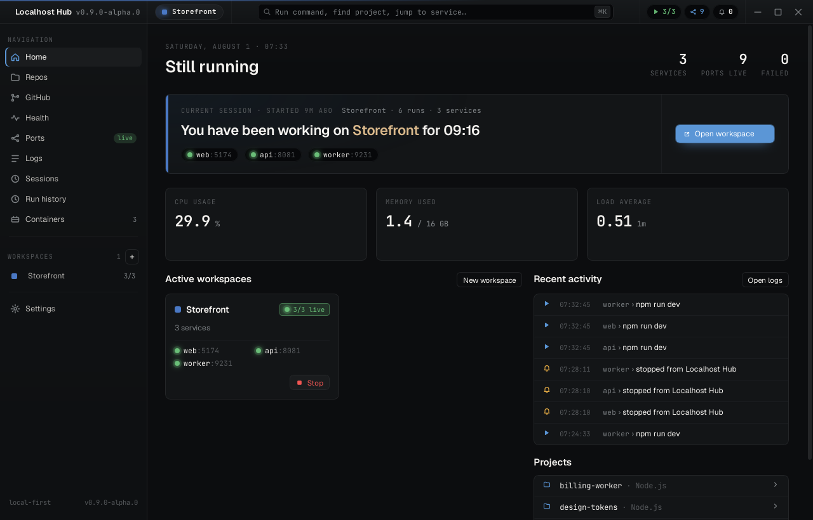
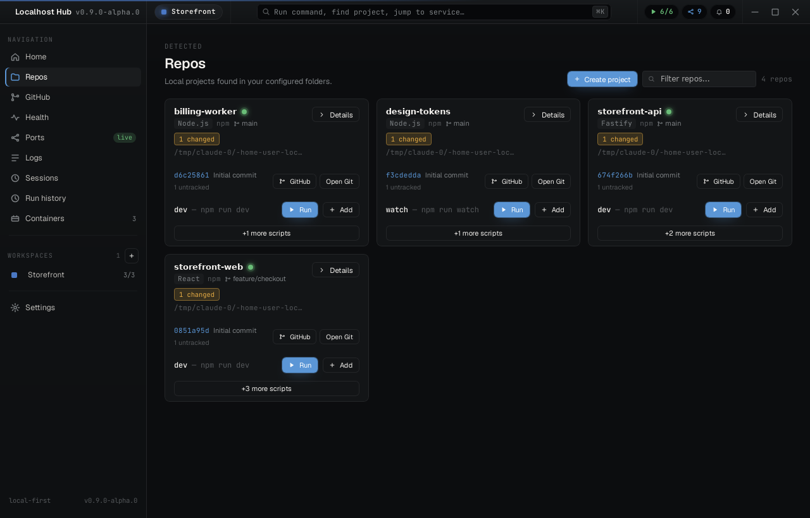
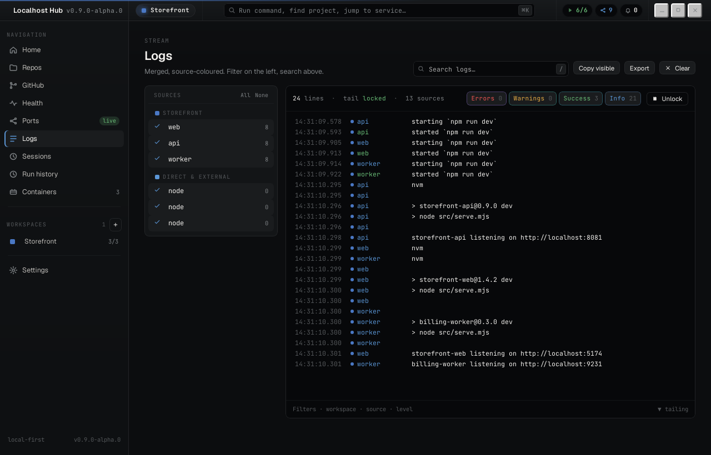
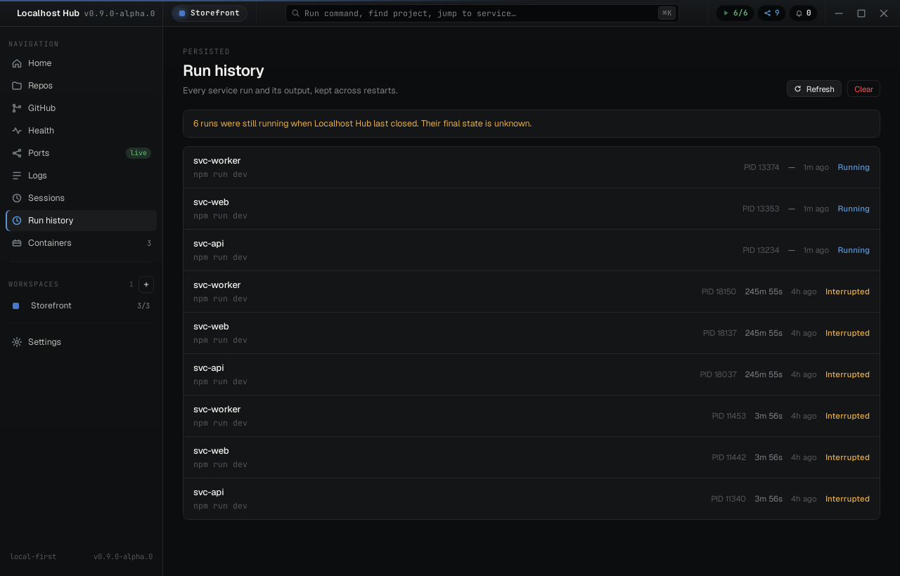
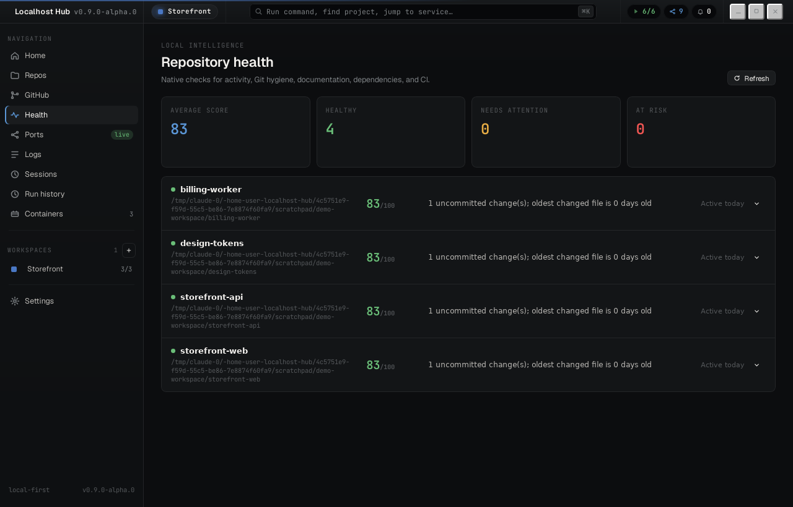
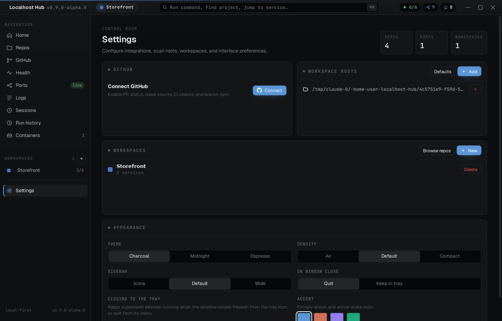

<div align="center">


# Localhost Hub

**One window for every project on your machine.**
Find them, run them, watch their logs and ports, and keep their Git in view — without a terminal tab per service.

Local-first · no telemetry · MIT

</div>



---

## Contents

- [Why](#why)
- [What it does](#what-it-does)
- [Getting started](#getting-started)
- [How it works](#how-it-works)
- [Where your data lives](#where-your-data-lives)
- [Development](#development)
- [Packaging and releases](#packaging-and-releases)
- [Project status](#project-status)
- [Troubleshooting](#troubleshooting)
- [License](#license)

---

## Why

A full-stack change usually means a web server, an API, a worker, and a database — four terminals, four sets of scrollback, and a guess at which port belongs to which. Localhost Hub puts them in one place: start the group, read one merged log, see which ports are actually listening, and check what Git thinks before you switch branches.

It runs entirely on your machine. Nothing is uploaded, and there is no account.

---

## What it does

### Finds your projects

Point it at the folders you keep code in. It walks them and reports what it finds — framework, package manager, runnable scripts, Git branch, uncommitted work — for JavaScript and TypeScript, Rust, Go, Python, Ruby, and PHP.

Discovery is stateless: each scan reads the filesystem fresh, so nothing can go stale between a rescan and what you are looking at.



### Runs groups of services together

Collect services into a workspace and start the whole thing at once. Declare what depends on what and they launch in order, waiting for a prerequisite to be ready before unlocking whatever needs it — and reporting downstream services as blocked when a prerequisite fails, rather than starting them into a broken world.

Stopping escalates from `SIGTERM` to `SIGKILL` across the whole process group, so a dev server's children do not survive it.

### Merges every log into one stream

Colour-coded by source, filterable by service and level, searchable. Ports and URLs are picked out of the output, so "which port did that one get" stops being a question.



### Remembers what ran

Every run is recorded with its command, timing, exit status, and full output, and it survives closing the app. Runs that were still going when the app last closed are marked interrupted rather than presented as though they were still live.



### Keeps an eye on repository hygiene

Uncommitted work that has been sitting too long, unpushed commits, branches nobody has touched in months, a missing README or licence, absent CI. All computed locally from the filesystem and Git.



### Plus

- **Ports** — every listening port on the machine, which process owns it, and a preflight check that catches a conflict before a service fails to bind.
- **Git** — branch, ahead/behind, staged and unstaged changes, diffs, commits, branches, remotes, and fetch/pull/push.
- **GitHub** — connect an account to see the pull request for your current branch, open issues, and CI results for the commit you are on.
- **Packages** — dependency inspection, audit, and outdated checks across npm, pnpm, yarn, and Bun.
- **New project** — a scaffolder for a starter with the scripts, dependencies, and styling you actually want.
- **Environment profiles** — named sets of variables per project, applied per service, with secret values held in your operating system's credential store rather than a file.
- **Close to the tray** — optionally keep supervised services running when you close the window, and reopen from the tray icon.



---

## Getting started

### Requirements

- Node.js 20+ and npm 10+ (your projects can use pnpm, yarn, or Bun)
- Git
- Rust 1.77.2+ and the [Tauri prerequisites](https://v2.tauri.app/start/prerequisites/)

### Run it

```bash
npm install
npm run dev
```

On first launch, choose the folders to scan. That is the only setup.

To enable the optional GitHub connection, set `GITHUB_CLIENT_ID` at build time. Everything local works without it.

> [!NOTE]
> `npm run dev` starts the Vite dev server and opens the Tauri window. `npm run dev:web` serves the interface in a plain browser, without the native backend. Read commands return empty values so the interface still renders, and anything that would change state fails with a clear message rather than pretending to work.

---

## How it works

React owns the interface. Rust owns everything privileged — the filesystem, processes, ports, Git, persistence — and the two talk over typed Tauri commands.

```
src/                          The interface
  App.tsx                     Root, state orchestration
  view-*.tsx                  Top-level views
  tauri-api.ts                The only path to the backend
  generated/                  TypeScript types generated from the Rust structs

src-tauri/src/                The backend
  commands.rs                 Every command the interface can invoke
  workspace.rs                Discovery, dependency ordering, readiness
  services.rs                 Process lifecycle and output streaming
  ports.rs                    Listening sockets, localhost URL parsing
  git.rs / github.rs          Local Git via git2; GitHub as a separate concern
  packages.rs / scaffold.rs   Package managers; project creation
  health.rs                   Repository health signals
  config.rs / secrets.rs      Persistence; credential store
  history.rs                  Run history and stored output
```

**The boundary is checked by the compiler.** Every type crossing it is generated from the Rust struct by [ts-rs](https://github.com/Aleph-Alpha/ts-rs), so renaming a Rust field breaks the build at each call site that reads it instead of surfacing as an `undefined` at runtime. Continuous integration fails if the committed bindings drift from the Rust definitions.

Built with React 19, Vite 7, Tauri 2, Tokio, and Framer Motion.

---

## Where your data lives

Everything sits under your platform's application data directory — `~/.local/share/dev.madsens.localhost-hub` on Linux, `~/Library/Application Support` on macOS, `%APPDATA%` on Windows.

| Path | Holds |
| --- | --- |
| `config.json` | Scan folders, workspaces, environment profiles, appearance, window behaviour |
| `history/runs.json` | The last 200 runs, with timing and outcome |
| `history/logs/*.log` | One append-only log per run, capped at 2 MiB |
| OS credential store | The GitHub token and any variable marked secret |

Secrets go to Keychain on macOS, Credential Manager on Windows, and the Secret Service on Linux. Where no credential store exists — a headless session, a container — they fall back to a file readable only by your account, and Settings tells you which is in use rather than implying the credential store always is.

Nothing leaves your machine.

---

## Development

```bash
npm run dev                # run the app
npm run dev:web            # browser-only frontend server
npm test                   # interface tests
npm run lint               # ESLint
npm run typecheck          # both TypeScript projects
npm run generate:bindings  # regenerate the TypeScript types from Rust
```

```bash
cd src-tauri
cargo test                 # backend tests, including the type-binding exports
cargo clippy --all-targets -- -D warnings
```

The Rust toolchain is pinned in `src-tauri/rust-toolchain.toml`, so local checks and continuous integration run the same compiler and a new Clippy release cannot fail the build on code nobody touched.

Continuous integration runs the lot on every pull request: lint, both typecheck projects, the interface tests, a production build, Clippy with warnings denied, the backend tests, and a check that the generated bindings still match the Rust definitions.

---

## Packaging and releases

Packaging is driven by Releases. Publishing a GitHub release builds every platform and attaches the installers to it:

| Platform | Formats |
| --- | --- |
| Linux | AppImage, DEB, RPM, Arch `.pkg.tar.zst` |
| macOS | DMG and `.app`, universal for Intel and Apple Silicon |
| Windows | MSI and NSIS |

Manual workflow runs produce the same artifacts on demand. Pull requests build Linux only, and only when they change the packaging definition itself.

See [Desktop Distribution](docs/DISTRIBUTION.md) for distro coverage, versioning, and signing status.

---

## Project status

`0.9.x` — the Electron-to-Tauri migration is complete and Tauri is the only shell. See [the unification plan](docs/UNIFICATION.md).

Honest about what is not done:

- **Packages are unsigned.** macOS Gatekeeper and Windows SmartScreen will warn until signing credentials are in place. Blocking for `1.0`.
- **Linux is the best-tested platform.** The Windows and macOS paths — process trees, port inspection, the credential store, the tray — need real use on those systems.
- **The Ports topology diagram has a layout bug** that clips nodes at the left edge. The Active ports table below it is correct.
- **No Docker integration yet**, despite the Containers entry in the sidebar.

What is planned, in order, lives in [the implementation backlog](docs/IMPLEMENTATION_BACKLOG.md). The original product brief is kept as [PROJECT.md](PROJECT.md) for its intent; its architecture section describes the implementation Tauri replaced.

Further out: SSH tunnelling and remote discovery, richer diffs and staging, pluggable script types such as Docker Compose and Make, and [Localhost Companion](docs/LOCALHOST_COMPANION.md) — a focused Android remote.

---

## Troubleshooting

**Unsigned build warnings.** Expected until signing is configured. On macOS, right-click and choose Open; on Windows, choose More info then Run anyway.

**Rendering problems on Linux.** Tauri uses WebKitGTK, so if the window renders oddly or the GPU drivers are unreliable, try:

```bash
WEBKIT_DISABLE_COMPOSITING_MODE=1 localhost-hub
WEBKIT_DISABLE_DMABUF_RENDERER=1 localhost-hub   # if the first does not help
```

**Services will not start.** Check the command runs in that directory in your own shell first. If an environment profile is set not to inherit the system environment, it runs over a documented minimal baseline rather than your full shell setup.

**Icons look wrong after changing assets.** Re-run `npm run generate:icons`, and make sure `buildResources/` has the generated `.icns`, `.ico`, `.png`, and `linux-icons/**`.

---

## License

MIT © Christoffer Madsen — see [LICENSE](./LICENSE).
